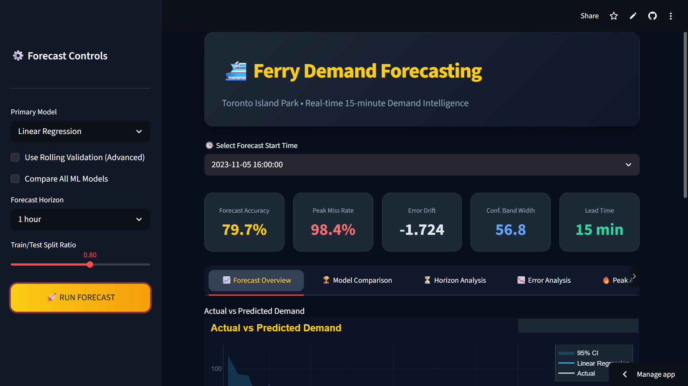
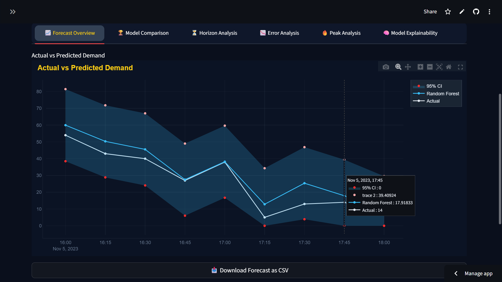
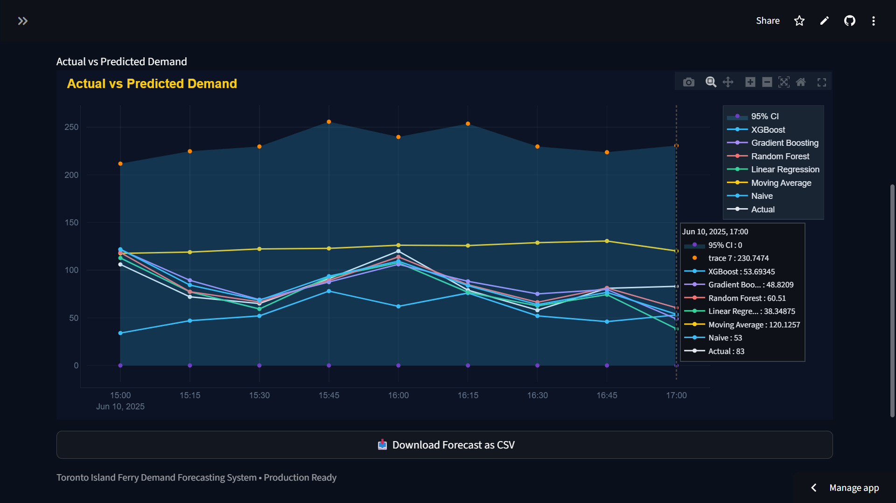

# Ferry Demand Forecasting & Passenger Flow Intelligence Dashboard

[Live Application](https://your-streamlit-link.streamlit.app/)
[GitHub Repository](https://github.com/yourusername/ferry-demand-forecasting-dashboard)


---

# Overview

This project presents an intelligent ferry demand forecasting system designed to predict short-term passenger traffic for the Toronto Island Ferry transportation network.

The dashboard integrates machine learning, rolling validation, uncertainty modeling, and multi-horizon forecasting to estimate future passenger demand patterns.

Rather than only visualizing historical ticket volume, the system provides predictive intelligence that helps optimize ferry operations, staffing, scheduling, and passenger flow management.

The framework combines forecasting analytics with KPI diagnostics to support transportation planning and operational decision-making.

---

# Business Context

Public transportation systems often experience fluctuating passenger demand driven by:

* Seasonal tourism patterns
* Weekend vs weekday traffic
* Weather-related travel behavior
* Holiday-driven demand spikes
* Peak-hour congestion variability
* Operational uncertainty during high-volume periods

Without predictive demand visibility, ferry operators may face:

* Understaffing during peak demand
* Resource over-allocation during low demand
* Longer wait times
* Passenger congestion
* Reduced scheduling efficiency

This forecasting dashboard provides structured demand intelligence to reduce uncertainty.

---

# Live Dashboard

Access the deployed application:

```text
https://your-streamlit-link.streamlit.app/
```

The dashboard enables interactive forecasting, KPI monitoring, and demand analysis across multiple time horizons.

---

# Dashboard Preview

Add screenshots inside the `assets/` folder and reference them here.

```markdown



```

---

# Key Features

## Interactive Forecasting Dashboard

* Dynamic model selection
* Time-series passenger forecasting
* Rolling forecast validation
* Multi-horizon prediction support
* Interactive visualization with Plotly

## KPI Monitoring

* Forecast Accuracy
* Peak Miss Rate
* Error Drift
* Confidence Band Width
* Forecast Lead Time

## Machine Learning Model Comparison

The dashboard evaluates multiple forecasting approaches:

* Random Forest
* Gradient Boosting
* XGBoost
* Prophet Forecasting
* Time-Series Baselines

## Uncertainty Modeling

* Confidence interval estimation
* Forecast band generation
* Prediction reliability monitoring

## Multi-Horizon Forecasting

Supports forecasting across multiple future windows.

Examples:

* Next hour demand
* Same-day traffic prediction
* Short-term operational planning

---

# Forecasting Intelligence

This project focuses on operational forecasting intelligence rather than simple historical visualization.

The system identifies:

* Passenger demand spikes
* High-risk congestion periods
* Forecast reliability
* Error behavior over time
* Model stability across horizons

---

# Analytical Insights

* Passenger demand follows strong seasonal and temporal patterns
* Peak ferry usage clusters around weekends and tourism periods
* Forecasting accuracy improves when engineered features are incorporated
* Demand uncertainty increases during irregular traffic periods
* Rolling validation improves reliability compared to static train-test evaluation

---

# Strategic Use Cases

* Ferry scheduling optimization
* Staff allocation planning
* Passenger congestion management
* Tourism demand forecasting
* Resource utilization planning
* Transportation operations intelligence

---

# Technology Stack

* Python
* Streamlit
* Pandas
* NumPy
* Plotly
* Scikit-learn
* XGBoost
* Prophet
* Time Series Forecasting
* Machine Learning

---

# Project Structure

```text
project-root/
│
├── app/
│   └── app.py
│
├── data/
│   └── Toronto Island Ferry Tickets.csv
│
├── src/
│   ├── baseline_models.py
│   ├── data_loader.py
│   ├── evaluation.py
│   ├── features.py
│   ├── horizon_metrics.py
│   ├── kpis.py
│   ├── multi_horizon.py
│   ├── prophet_model.py
│   ├── rolling_validation.py
│   ├── time_series_models.py
│   ├── train_test_split.py
│   ├── uncertainty.py
│   └── validation.py
│
├── README.md
└── requirements.txt
```

---

# Run Locally

Install dependencies:

```bash
pip install -r requirements.txt
```

Run the application:

```bash
streamlit run app/app.py
```

Open in browser:

```text
http://localhost:8501
```

---

# Forecasting Workflow

1. Load historical ferry ticket data
2. Perform feature engineering
3. Split time-series data chronologically
4. Train forecasting models
5. Validate through rolling forecasting windows
6. Generate prediction intervals
7. Compare models using KPI diagnostics
8. Visualize forecasts inside interactive dashboard

---

# Future Improvements

* Real-time ferry API integration
* Weather feature integration
* Passenger anomaly detection
* Deep learning forecasting models
* Live congestion prediction
* Automated model retraining

---

# Conclusion

This project demonstrates how forecasting intelligence can improve transportation planning and passenger flow management.

By combining machine learning, uncertainty modeling, rolling validation, and KPI diagnostics, the system creates a scalable framework for demand-aware ferry operations.

The dashboard bridges predictive analytics with operational decision-making.

---

# Author

Nikhil Kumar Singh

BCA (Artificial Intelligence & Machine Learning)

AI & Data Analytics Enthusiast

GitHub: [https://github.com/nikhilsingh-k](https://github.com/nikhilsingh-k)

LinkedIn: [https://www.linkedin.com/in/nikhilsingh-k/](https://www.linkedin.com/in/nikhilsingh-k/)
