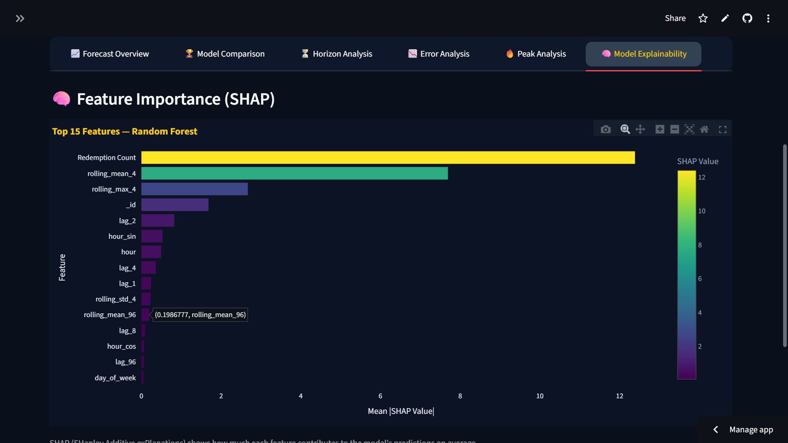

# ⛴️ Ferry Demand Forecasting & Passenger Flow Intelligence Dashboard

[](https://ferry-demand-forecast.streamlit.app)
[](https://github.com/nikhilsingh-k/ferry-demand-forecast)


---

## Overview

This project presents an intelligent ferry demand forecasting system designed to predict short-term passenger traffic for the Toronto Island Ferry transportation network.

The dashboard integrates **8 machine learning and statistical models**, rolling validation, uncertainty modeling, SHAP explainability, and multi-horizon forecasting to estimate future passenger demand patterns at 15-minute intervals.

Rather than only visualizing historical ticket volume, the system provides predictive intelligence that helps optimize ferry operations, staffing, scheduling, and passenger flow management.

The framework combines forecasting analytics with KPI diagnostics to support transportation planning and operational decision-making.

---

## Business Context

Public transportation systems often experience fluctuating passenger demand driven by:

- Seasonal tourism patterns
- Weekend vs weekday traffic
- Weather-related travel behavior
- Holiday-driven demand spikes
- Peak-hour congestion variability
- Operational uncertainty during high-volume periods

Without predictive demand visibility, ferry operators may face:

- Understaffing during peak demand
- Resource over-allocation during low demand
- Longer passenger wait times
- Reduced scheduling efficiency
- Missed high-congestion periods

This forecasting dashboard provides structured demand intelligence to reduce operational uncertainty.

---

## Live Dashboard

Access the deployed application:

```
https://ferry-demand-forecast.streamlit.app
```

The dashboard enables interactive forecasting, KPI monitoring, SHAP explainability, and demand analysis across multiple time horizons.

---

## Dashboard Preview





---

## Key Features

### Interactive Forecasting Dashboard
- Dynamic model selection across 8 algorithms
- 15-minute interval passenger demand forecasting
- Rolling forecast validation (walk-forward CV)
- Multi-horizon prediction: 15 min → 2 hours
- Interactive Plotly visualizations with unified hover
- CSV export of any forecast with timestamps

### KPI Monitoring

| KPI | Definition |
|---|---|
| **Forecast Accuracy** | `100 - MAPE` with robust epsilon to handle zero-demand periods |
| **Peak Miss Rate** | % of high-demand periods the model failed to anticipate |
| **Error Drift** | MAE(second half) − MAE(first half) — positive means degrading over time |
| **Conf. Band Width** | Average width of the 95% prediction interval |
| **Lead Time** | Minutes ahead a predicted peak fires before the actual peak |

### Machine Learning Model Comparison

The dashboard evaluates 8 forecasting approaches side by side:

| Model | Type |
|---|---|
| Naive | Baseline |
| Moving Average | Baseline |
| Linear Regression | ML |
| Random Forest | ML |
| Gradient Boosting | ML |
| XGBoost | ML |
| ARIMA | Statistical |
| Prophet | Statistical |

### SHAP Explainability
- Feature importance for Random Forest, Gradient Boosting, XGBoost
- TreeExplainer-based SHAP values
- Top 15 feature bar chart with color-coded impact scores

### Uncertainty Modeling
- Residual-based 95% confidence interval estimation
- Prediction bands clipped to physical minimum (no negative demand)
- Forecast reliability monitoring per model

### Multi-Horizon Forecasting
- 15-minute operational window
- 30-minute short-term planning
- 1-hour scheduling support
- 2-hour capacity planning

---

## Forecasting Intelligence

This project focuses on operational forecasting intelligence rather than simple historical visualization.

The system identifies:
- Passenger demand spikes using robust IQR-based thresholds
- High-risk congestion periods before they occur
- Forecast reliability via confidence band width
- Error behavior drift over time
- Model stability across multiple forecast horizons

---

## Analytical Insights

- Passenger demand follows strong seasonal and temporal patterns
- Peak ferry usage clusters around weekends and summer tourism periods
- Forecasting accuracy improves significantly with engineered lag and rolling features
- Demand uncertainty increases during irregular high-traffic periods
- Rolling validation produces more reliable estimates than static train/test splits
- Extreme outlier spikes (up to 5,342 passengers per slot) require robust peak detection

---

## Strategic Use Cases

- Ferry scheduling optimization
- Staff allocation planning
- Passenger congestion management
- Tourism demand forecasting
- Resource utilization planning
- Transportation operations intelligence

---

## Technology Stack

`Python` · `Streamlit` · `Pandas` · `NumPy` · `Plotly` · `Scikit-learn` · `XGBoost` · `Prophet` · `ARIMA` · `SHAP` · `StatsModels`

---

## Project Structure

```
ferry-demand-forecast/
│
├── app.py                    ← Streamlit entry point
├── requirements.txt
├── README.md
│
├── src/
│   ├── data_loader.py        ← Load & resample raw CSV
│   ├── features.py           ← Time/lag/rolling feature engineering
│   ├── train_test_split.py   ← Temporal train/test split
│   ├── baseline_models.py    ← Naive, MA, LR, RF, GB, XGBoost
│   ├── time_series_models.py ← ARIMA
│   ├── prophet_model.py      ← Facebook Prophet
│   ├── evaluation.py         ← MAE, RMSE, MAPE metrics
│   ├── kpis.py               ← 5 operational KPI calculations
│   ├── uncertainty.py        ← Prediction interval estimation
│   ├── horizon_metrics.py    ← Per-horizon performance breakdown
│   ├── multi_horizon.py      ← Multi-step forecasting logic
│   ├── rolling_validation.py ← Walk-forward cross-validation
│   └── validation.py         ← Input data validation
│
├── data/
│   └── Toronto Island Ferry Tickets.csv
│
└── assets/
    ├── dashboard_overview.png
    ├── forecast_chart.png
    ├── model_comparison.png
    └── shap_features.png

```

---

## Run Locally

Clone the repository:

```bash
git clone https://github.com/nikhilsingh-k/ferry-demand-forecast
cd ferry-demand-forecast
```

Install dependencies:

```bash
pip install -r requirements.txt
```

Run the application:

```bash
streamlit run app.py
```

Open in browser:

```
http://localhost:8501
```

---

## Forecasting Workflow

1. Load historical ferry ticket data (2015–2025, 15-min intervals)
2. Engineer time, lag, and rolling window features
3. Split time-series data chronologically (no data leakage)
4. Train selected forecasting model(s)
5. Validate through rolling forecasting windows
6. Generate residual-based 95% prediction intervals
7. Compare models using 5 operational KPI diagnostics
8. Visualize forecasts in interactive dashboard with SHAP explainability

---

## Future Improvements

- Real-time ferry API integration
- Weather feature integration (temperature, precipitation)
- Passenger anomaly detection
- Deep learning forecasting (LSTM, Temporal Fusion Transformer)
- Live congestion prediction
- Automated model retraining pipeline

---

## Conclusion

This project demonstrates how forecasting intelligence can improve transportation planning and passenger flow management.

By combining machine learning, uncertainty modeling, rolling validation, SHAP explainability, and KPI diagnostics, the system creates a scalable framework for demand-aware ferry operations.

The dashboard bridges predictive analytics with operational decision-making in a fully deployable, interactive application.

---

## Author

**Nikhil Kumar Singh**
BCA — Artificial Intelligence & Machine Learning
AI & Data Analytics Enthusiast

[](https://www.linkedin.com/in/nikhilsingh-k/)
[](https://github.com/nikhilsingh-k)
